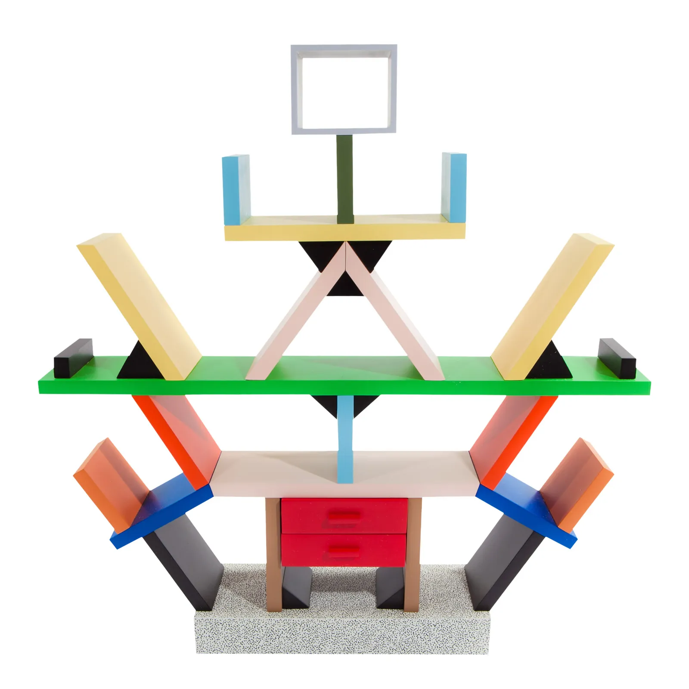
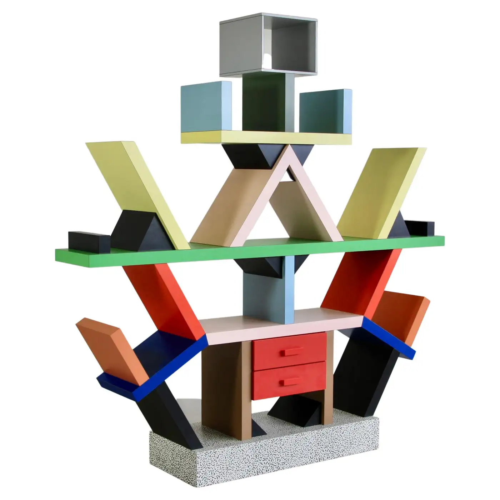

# sjia0688_9103_Carlos-Fgroup

> design research for major assignments：*Anwar Jalal Shemza 'Apple Tree'*

### Part 1: Imaging Technique Inspiration
I was inspired by *Ettore Sottsass’s Carlton bookshelf*, an iconic piece of Memphis design. Its vibrant colors, symmetrical composition, repetitive graphics and structure built entirely from geometric shapes offer valuable reference points for reinterpreting Apple Tree.

### Part 2: Coding Technique Exploration
Using classes is an effective coding technique when creating multiple visual elements with shared structure. In my project, I can use a class to define geometric modules, applying consistent shapes while customizing properties like color, size, or position. This approach mirrors the structured yet varied design of the Carlton bookshelf and helps manage complex compositions efficiently.

> here's the reference -> [class](https://p5js.org/reference/p5/class/)